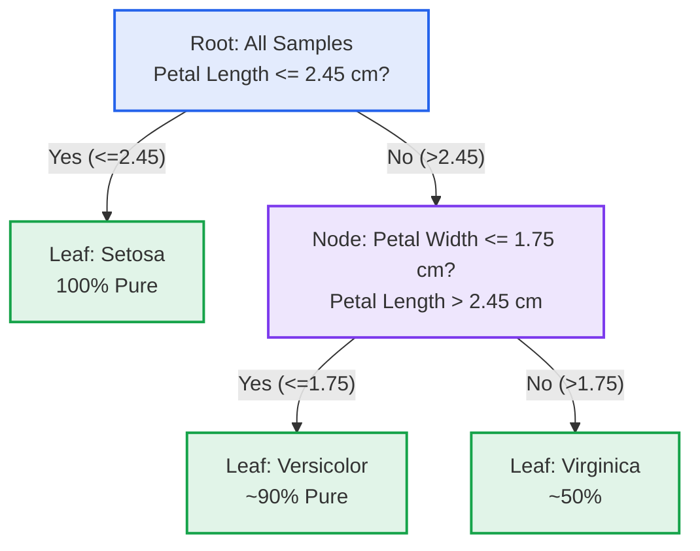
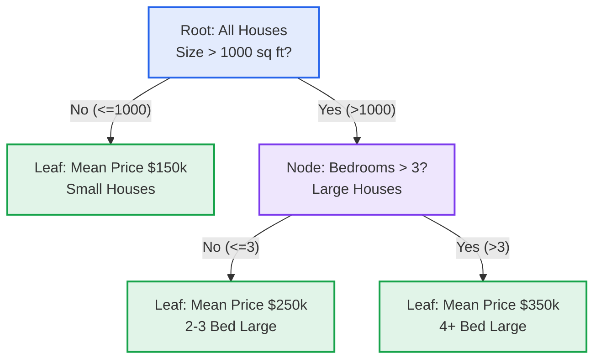
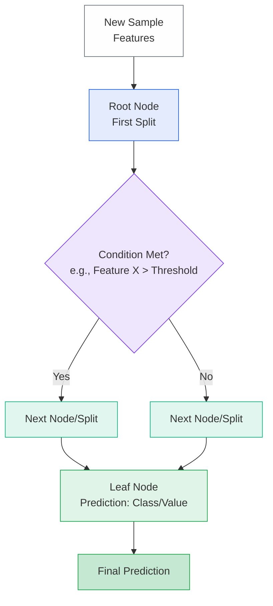
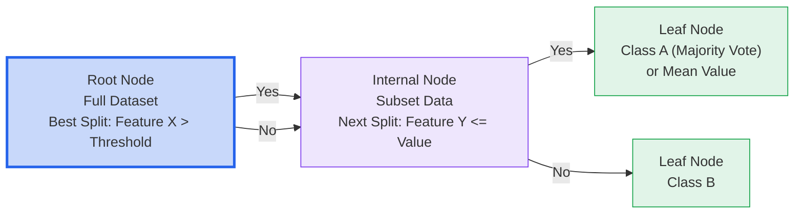
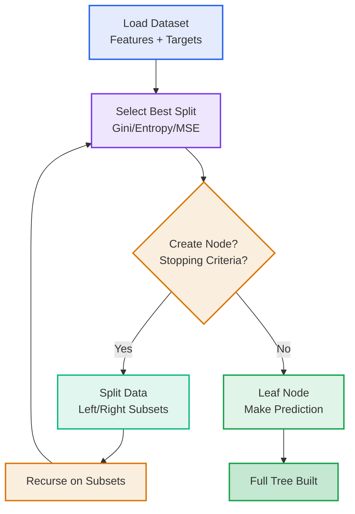
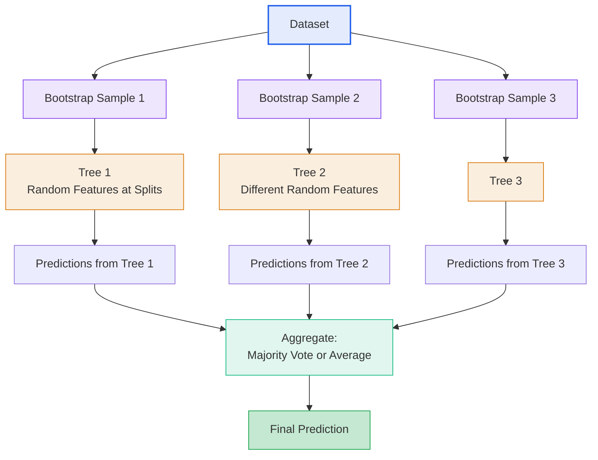
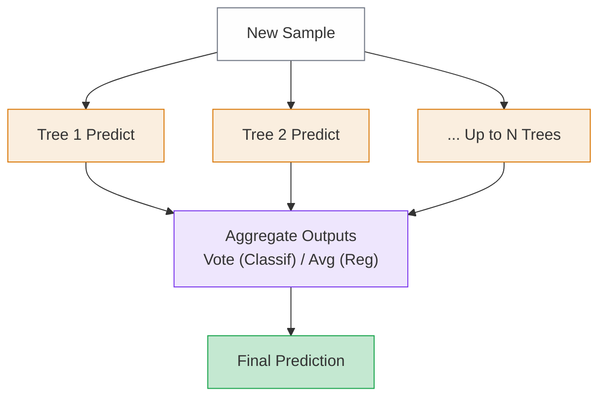
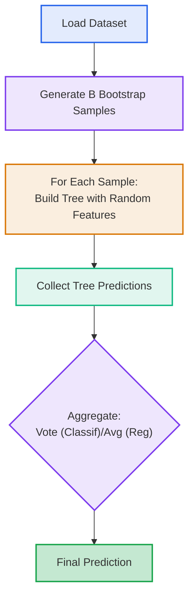

# Machine Learning Course Summary - Decision Trees and Random Forests

## Table of Contents

1. [Decision Trees](#decision-trees)
2. [Random Forests](#random-forests)
3. [Summary](#summary)

---

## Decision Trees

### What are Decision Trees?

Decision Trees are supervised learning models that represent decisions and their possible consequences as a tree-like structure. They are used for both classification (predicting categories) and regression (predicting continuous values) tasks.

- **Tree structure**: Root node (full dataset) branches into decision nodes based on features, leading to leaf nodes (predictions)
- **Non-parametric**: No assumptions about data distribution
- **Interpretable**: Easy to visualize and understand decision paths

### How Decision Trees Work

Decision Trees build by recursively splitting the dataset:

1. **Root Selection**: Choose the best feature to split the data at the root
2. **Splitting Criteria**: For classification, use Gini impurity or entropy; for regression, mean squared error (MSE)
3. **Recursion**: Repeat splitting on subsets until stopping criteria (e.g., max depth)
4. **Prediction**: For classification, majority class in leaf; for regression, mean value in leaf
5. **Pruning**: Post-build trimming to reduce overfitting by removing unnecessary branches

#### Detailed Explanation of Splitting Criteria

Splitting criteria determine the best way to divide the dataset at each node, maximizing purity (for classification) or minimizing error (for regression). The choice affects tree structure and performance.

##### Classification Criteria

- **Gini Impurity**  
  Measures the probability of misclassifying a random sample based on class distribution.  
  Formula:  
  $Gini = 1 - \sum_{i=1}^{C} p_i^2$  
  where $C$ is the number of classes, and $p_i$ is the proportion of class $i$.  

  - Ranges from 0 (pure subset) to 0.5 (max impurity for binary classes).  
  - For a split: $Gini_{split} = \frac{n_{left}}{n} Gini_{left} + \frac{n_{right}}{n} Gini_{right}$.  
  - Goal: Minimize $Gini_{split}$.  
  - Pros: Computationally efficient, less sensitive to class imbalance.  

  **Example**: Balanced dataset (50% A, 50% B): $Gini = 1 - (0.5^2 + 0.5^2) = 0.5$. Perfect split: $Gini_{split} = 0$.

- **Entropy (Information Gain)**  
  Quantifies uncertainty in the data.  
  Formula:  
  $Entropy = - \sum_{i=1}^{C} p_i \log_2(p_i)$  
  Ranges from 0 (pure) to 1 (max for binary).  

  - Information Gain: $IG = Entropy_{parent} - \left( \frac{n_{left}}{n} Entropy_{left} + \frac{n_{right}}{n} Entropy_{right} \right)$.  
  - Goal: Maximize $IG$.  
  - Pros: Emphasizes significant uncertainty reduction.  
  - Cons: More computationally expensive due to logs.  

  **Example**: Balanced dataset: $Entropy = - (0.5 \log_2(0.5) + 0.5 \log_2(0.5)) = 1$. Perfect split: $IG = 1$.

Gini and Entropy often produce similar trees; Gini is faster for large datasets.

##### Regression Criteria

- **Mean Squared Error (MSE)**  
  Measures variance around the mean prediction.  
  Formula:  
  $MSE = \frac{1}{n} \sum_{i=1}^{n} (y_i - \bar{y})^2$  

  - For a split: Weighted average of children's MSEs.  
  - Goal: Minimize to reduce variance.  
  - Cons: Sensitive to outliers (penalizes large errors heavily).  

  **Example**: Prices {100k, 150k, 200k}, mean=150k: $MSE = \frac{(100-150)^2 + (150-150)^2 + (200-150)^2}{3} \approx 1000k^2$. Split reduces overall MSE.

- **Mean Absolute Error (MAE)**  
  Measures average absolute deviation.  
  Formula:  
  $MAE = \frac{1}{n} \sum_{i=1}^{n} |y_i - \bar{y}|$  

  - For a split: Weighted sum of children's MAEs.  
  - Goal: Minimize absolute errors.  
  - Pros: Robust to outliers.  

In scikit-learn, defaults are Gini (classification) and MSE (regression). Choose based on data (e.g., MAE for outliers) and computational needs.

#### Example (Classification)

For iris dataset classifying flower species:

- Root split: Petal length > 2.5 cm?
  - Yes → Split on petal width → Leaf: Versicolor
  - No → Leaf: Setosa

For regression (house prices):

- Root split: Size > 1000 sq ft?
  - Yes → Mean price: $300k
  - No → Mean price: $150k

#### Decision Tree Structure Graph (Iris Classification)

This graph illustrates a simplified decision tree for the Iris dataset, showing how samples are partitioned based on feature thresholds to reach class predictions at the leaves, with approximate purity levels at leaves.

#### Regression Decision Tree Example Graph (House Prices)

This graph shows a simple regression tree for house price prediction, where leaves contain mean target values for the subset, demonstrating how continuous predictions are made.

#### Decision Tree Prediction Flow

### Tree Structure

Decision Trees consist of hierarchical nodes that progressively refine the dataset:

- **Root Node**: The top node containing the entire training dataset; first split is chosen here.
- **Internal Nodes**: Non-leaf nodes representing decisions based on a feature threshold (e.g., "Age > 30?"). Each leads to two child nodes.
- **Leaf Nodes**: Terminal nodes where splitting stops; store the prediction (majority class for classification, mean/median for regression).

The tree's depth and branching reflect the complexity of decision boundaries.

#### Components Visualization

### Pruning and Regularization

Pruning prevents overfitting by simplifying the tree:

- **Pre-pruning** (Early Stopping): Halt growth if max depth reached, minimum samples per split/leaf not met, or no significant impurity reduction.
- **Post-pruning** (Cost-Complexity Pruning): Grow full tree, then remove subtrees that increase validation error minimally. Uses a complexity parameter α to balance fit and simplicity.

| Pruning Type | Pros | Cons |
|--------------|------|------|
| **Pre-pruning** | Faster training; avoids deep trees | May underfit if stopped too early |
| **Post-pruning** | Better accuracy; explores full structure | More computationally intensive |

Regularization parameters like min_samples_leaf smooth leaves and reduce overfitting.

### Algorithm Pipeline (Decision Tree)

### Parameters and Tuning (Decision Tree)

| Parameter | Description | Impact |
|-----------|-------------|--------|
| **Max Depth** | Maximum tree levels | Deeper trees fit more but overfit |
| **Min Samples Split** | Min data for internal node | Higher values prevent overfitting |
| **Min Samples Leaf** | Min data for leaf | Smooths predictions, reduces overfitting |

Tuning: Use grid search and cross-validation to find optimal values.

---

## Random Forests

### What are Random Forests?

Random Forests are an ensemble learning method that combines multiple decision trees to improve predictive performance and control overfitting. Each tree is trained on a random subset of the data and features, and predictions are aggregated for robustness. They excel in classification and regression, often outperforming single trees on noisy or high-dimensional data.

- **Ensemble Structure**: Collection of diverse decision trees voting or averaging their outputs
- **Bagging + Randomness**: Reduces variance through bootstrap sampling and feature randomization
- **Robust and Accurate**: Handles overfitting better than single trees while maintaining interpretability via feature importances

### How Random Forests Work

Random Forests extend decision trees by introducing randomness and aggregation:

1. **Bootstrap Sampling (Bagging)**: Create multiple subsets of the training data by sampling with replacement (each ~63% unique samples). This introduces diversity among trees.
2. **Random Feature Selection**: At each split in a tree, consider only a random subset of features (e.g., √n for classification, n/3 for regression), preventing dominance by strong predictors and decorrelating trees.
3. **Tree Construction**: Build each decision tree independently using the same splitting criteria as single trees (e.g., Gini, MSE), but limited to random features.
4. **Aggregation**: For classification, use majority voting across trees; for regression, average predictions. Out-of-Bag (OOB) samples (not used in a tree's training) enable internal validation.
5. **Feature Importance**: Computed as the average decrease in impurity across trees when a feature is used for splitting, providing insights into relevance.

This process reduces the high variance of single trees, leading to more stable and accurate models.

#### Detailed Explanation of Splitting in Random Forests

Splitting mirrors decision trees but uses random feature subsets at each node for diversity. Core criteria (Gini, Entropy, MSE, MAE) are the same.

- **Feature Subset Size**: Typically $m = \sqrt{n}$ (classification) or $m = n/3$ (regression), where $n$ is total features. Sample $m$ features randomly per split and select the best.

  This decorrelates trees by limiting options, even for dominant features.

- **Impurity Calculation**: Compute criterion (e.g., Gini) only over the $m$ features; choose split minimizing weighted child impurity.

  **Example**: 10 features, $m \approx 3$. Sample {Age, Income, Education}. Test splits (e.g., Age > 30?), pick lowest $Gini_{split}$. Repeat per node.

- **Impact**: Less greedy splits reduce overfitting. For regression, MSE over fewer features adds robustness.

- **OOB Error**: ~37% data OOB per tree; aggregate for generalization estimate without validation set.

Individual trees may overfit, but ensemble averages errors for better performance.

#### Example (Classification with Random Forest)

For the Iris dataset, build 100 trees:

- Each tree on a bootstrap sample, using random 2 features per split (√4=2).
- Tree 1 might split on Petal Length first (Gini reduction high).
- Tree 2 on Sepal Width due to random selection.
- Prediction for a new sample: 95 trees vote Versicolor → Final: Versicolor.

For regression (house prices):

- 50 trees, each averaging prices in leaves based on random feature subsets (e.g., Size, Location).
- Final prediction: Average of 50 tree outputs, e.g., $280k.

#### Random Forest Structure Graph (Simplified Ensemble)

This illustrates how multiple trees, trained on varied data and features, contribute to a consensus prediction.

#### Random Forest Prediction Flow

### Key Components of Random Forests

- **Bootstrap Aggregating (Bagging)**: Trains trees on random samples to reduce variance.
- **Random Feature Selection**: Ensures tree diversity by limiting split options.
- **Voting/Averaging**: Combines predictions for final output.
- **Out-of-Bag (OOB) Error**: Internal estimate of model performance.
- **Feature Importance**: Mean impurity decrease per feature across trees.

### Pruning and Regularization in Random Forests

Individual trees can use the same pruning as decision trees, but the ensemble inherently regularizes via averaging. Parameters like max_depth apply per tree, while n_estimators controls ensemble size.

### Algorithm Pipeline (Random Forest)

### Parameters and Tuning (Random Forest)

| Parameter | Description | Impact |
|-----------|-------------|--------|
| **N Estimators** | Number of trees | More trees improve stability but increase time |
| **Max Features** | Features per split | 'sqrt' for classification, 'n_features/3' for regression |
| **Max Depth** | Depth per tree | Controls individual tree complexity |
| **Bootstrap** | Use sampling with replacement | True for bagging benefits |
| **Min Samples Split/Leaf** | As in decision trees, per tree | Prevents overfitting in individual trees |

Tuning Strategies:
1. **Grid Search**: Test combinations of n_estimators, max_features, max_depth.
2. **N Estimators**: Start with 100, increase until OOB error stabilizes.
3. **Max Features**: Tune based on problem dimensionality.
4. **Cross-Validation**: Use with OOB for efficient evaluation.

### Advantages Over Single Decision Trees

- **Reduced Overfitting**: Averaging smooths individual tree errors.
- **Improved Accuracy**: Often state-of-the-art on tabular data.
- **Feature Importance**: Global ranking across the ensemble.
- **Robustness**: Handles noisy data and outliers better.
- **Parallelizable**: Trees trained independently.

---

## Summary

### Core Principles

| Principle | Description |
|-----------|-------------|
| **Recursive Partitioning** | Split data hierarchically for pure subsets in trees; extended to ensembles in RF |
| **Impurity Measures** | Guide splits (Gini, Entropy, MSE) to maximize gain; randomized in RF for diversity |
| **Ensemble Averaging** | RF reduces variance by combining multiple trees via bagging and feature randomness |
| **Interpretability** | Trees show explicit decisions; RF provides feature importances for insights |

### Algorithm Parameters

| Parameter | Tuning Guideline |
|-----------|------------------|
| **Max Depth** | Limit to 5-20; use CV to find optimal for both trees and per-tree in RF |
| **N Estimators (RF)** | 100-500; more for better stability, monitor OOB error |
| **Min Samples Leaf** | 1-10 to control overfitting in leaves |
| **Max Features** | sqrt(total) for classification; adjust via grid search |

### Best Practices

- **Preprocess Data**: Encode categoricals; no scaling needed, but handle missing values (impute or use built-in handling).
- **Cross-Validate**: Use k-fold CV for hyperparameter tuning; leverage OOB in RF for quick estimates.
- **Prune Trees**: Apply cost-complexity pruning; in RF, rely on ensemble regularization.
- **Feature Engineering**: Select relevant features; use RF importances for selection.
- **Evaluate Models**: For trees, check depth and purity; for RF, monitor OOB vs. test error to detect overfitting.
- **Handle Imbalance**: Use class weights in both; RF benefits from balanced bootstraps.
- **Scalability Tips**: Limit n_estimators for large data; parallelize tree building.

### When to Use

- **Decision Trees**: For interpretable models on small/medium datasets; quick prototyping; when explainability is key (e.g., medical decisions).
- **Random Forests**: High-dimensional or noisy data; when accuracy > interpretability; baseline for tabular ML (e.g., finance, customer analytics).
- **Both**: Non-linear problems; mixed feature types; avoid when data is very large (consider sampling) or sequential (use RNNs/LSTMs).
- **Imbalanced Classes**: RF with undersampling or weights.
- **Quick Insights**: Trees for rules; RF for feature rankings.

### Performance Considerations

- **Training Time**: Single trees: O(n log n); RF: O(n_estimators * n log n), but parallelizable.
- **Prediction Speed**: Trees: O(depth); RF: O(n_estimators * depth)—faster with fewer trees.
- **Memory Usage**: Trees: O(nodes); RF: O(n_estimators * nodes)—store only necessary for prediction.
- **Scalability**: RF handles thousands of features; use subsampling for millions of samples.
- **Bias-Variance**: Trees high variance (overfit); RF low variance via averaging.

### Advanced Techniques

- **Gradient Boosting**: Sequential trees (e.g., XGBoost, LightGBM) for higher accuracy over RF.
- **Extra Trees**: RF variant with fully random splits for faster training.
- **Feature Selection**: Iterate with RF importances to reduce dimensionality.
- **Hybrid Models**: Stack RF with neural networks or use in pipelines for end-to-end ML.
- **Extensions**: Isolation Forests for anomaly detection; RF regressors for time series with lags.

Decision Trees provide a foundational, interpretable approach to ML, while Random Forests enhance this with ensemble power for robust, high-performance predictions. Together, they form versatile tools for real-world applications, from diagnostics to forecasting, emphasizing the value of simplicity and aggregation in model design.

## Additional Resources

### Videos

- [Decision Tree Classification Clearly Explained!](https://www.youtube.com/watch?v=ZVR2Way4nwQ)
- [Random Forest Algorithm Clearly Explained!](https://www.youtube.com/watch?v=v6VJ2RO66Ag)