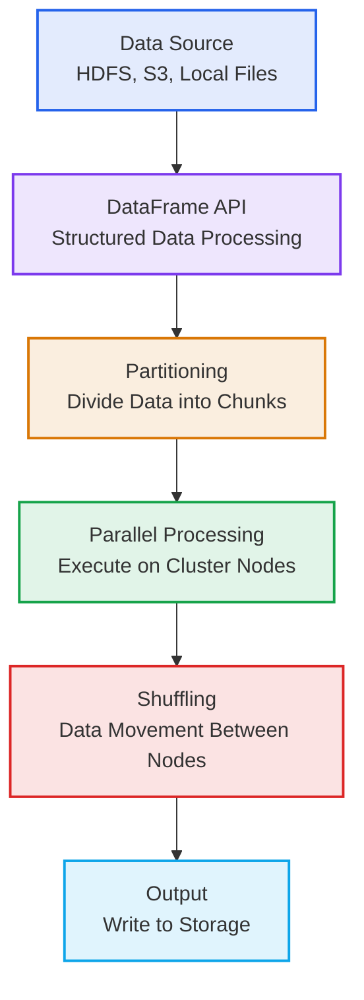
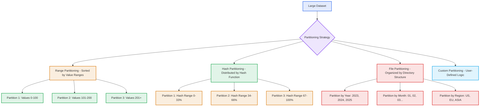
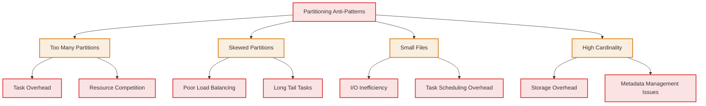
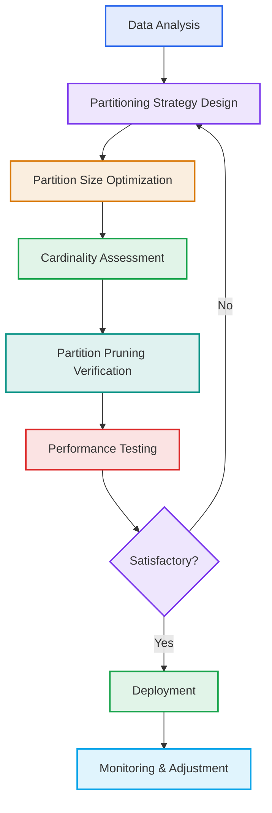
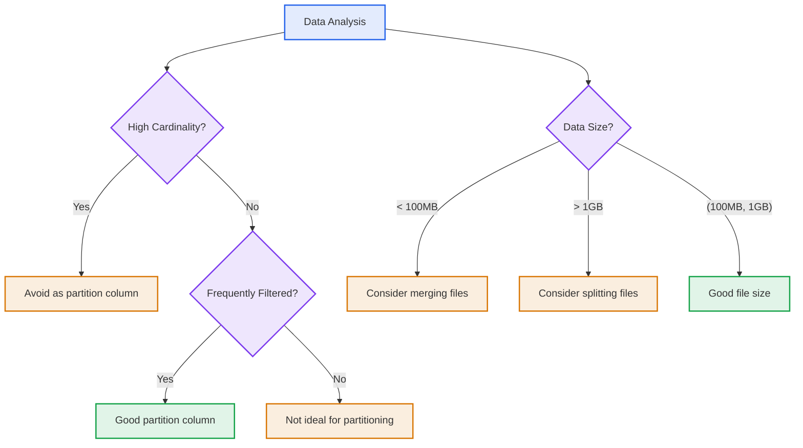

# Spark I/O and File Layout: Partitioning Best Practices & Parquet Introduction

## Table of Contents

1. [Introduction to Spark I/O](#introduction-to-spark-io)
2. [File Layout and Partitioning](#file-layout-and-partitioning)
3. [Partitioning Best Practices](#partitioning-best-practices)
4. [Introduction to Parquet](#introduction-to-parquet)
5. [Key Takeaways](#key-takeaways)

---

## <a name="introduction-to-spark-io"></a>Introduction to Spark I/O

### What is Spark I/O?

Apache Spark I/O (Input/Output) refers to the mechanisms and operations for reading data from and writing data to various storage systems. Spark provides a unified interface for working with structured data across different formats and storage systems.

- **Distributed Data Processing**: Spark reads data in parallel across multiple nodes in a cluster
- **Format Support**: Supports various data formats like CSV, JSON, Parquet, ORC, Avro, etc.
- **Storage Systems**: Works with HDFS, S3, Azure Blob Storage, local file systems, and more
- **Performance Optimization**: Optimized for large-scale data processing with in-memory computing

### Spark I/O Architecture

Spark I/O operations follow a distributed approach:

1. **Data Partitioning** 🗂️: Input data is divided into partitions that can be processed in parallel
2. **Data Locality** 📍: Spark tries to schedule computation close to where the data resides
3. **Fault Tolerance** 🛡️: Data is resilient to node failures through lineage graphs
4. **Caching** 🧠: Intermediate data can be cached in memory for faster access

### Spark I/O Pipeline Visualization



### Core Components of Spark I/O

| Component | Purpose | Key Features |
|-----------|---------|--------------|
| **DataSource API** 🗄️ | Unified interface for reading/writing data | Format abstraction, schema inference |
| **Partitioning** 🗂️ | Divides data for parallel processing | Configurable partitioning strategies |
| **Serialization** 📦 | Converts objects for network transfer | Fast serialization with Tungsten |
| **Caching** 🧠 | Stores intermediate results in memory | Multiple storage levels (MEMORY, DISK, etc.) |
| **Shuffling** 🔄 | Data movement during transformations | Configurable buffer sizes and compression |

### Common I/O Operations

Spark provides a rich set of I/O operations:

- **Read Operations**: Loading data from various sources with schema inference
- **Write Operations**: Saving data with different partitioning and compression options
- **Streaming I/O**: Processing continuous data streams with Spark Structured Streaming
- **Connector Integration**: Integration with Kafka, Cassandra, HBase and other systems

---

## <a name="file-layout-and-partitioning"></a>File Layout and Partitioning

### What is Data Partitioning?

Data partitioning is the process of dividing a large dataset into smaller, more manageable pieces called partitions. Each partition is a subset of the data that can be processed independently and in parallel.

### Partitioning in Spark

In Spark, data is partitioned across the cluster to enable parallel processing:

- **Input Partitioning** 📥: How data is divided when read from storage
- **Shuffle Partitioning** 🔄: How data is redistributed during transformations
- **Output Partitioning** 📤: How data is organized when written to storage

### Types of Partitioning

1. **Range Partitioning** 📊: Data is partitioned based on value ranges
2. **Hash Partitioning** 🔢: Data is partitioned using hash functions on keys
3. **File Partitioning** 📁: Data is partitioned based on file directory structure
4. **Custom Partitioning** ⚙️: User-defined partitioning logic

### Partitioning Strategies Visualization



### Partitioning Mechanics

#### Input Partitioning Details

- **File-based partitioning**: Spark creates partitions based on the number and size of input files
- **Default partition size**: Spark typically creates one partition per 128MB of compressed input data
- **Parallel reading**: Each partition can be read and processed independently across cluster nodes

#### Shuffle Partitioning Details

- **Repartitioning**: Changes the number of partitions in a DataFrame
- **Coalesce**: Reduces the number of partitions without full shuffling
- **Partition by key**: Groups records with the same key into the same partition

#### Output Partitioning Details

- **Partition by columns**: Organizes output files by specified columns
- **Bucketing**: Advanced partitioning technique for optimizing joins and lookups
- **File size optimization**: Ensures output files are of appropriate size for efficiency

### Impact of Partitioning on Performance

1. **Parallelism**: More partitions allow for greater parallel processing
2. **Resource Utilization**: Proper partitioning ensures all cluster resources are used effectively
3. **Network Overhead**: Excessive partitioning increases shuffle operations and network traffic
4. **Memory Usage**: Each partition requires memory for processing and buffering

### Partitioning Considerations

When designing partitioning strategies, consider:

- **Data size**: Partition sizes should align with available cluster memory
- **Cluster resources**: Partitioning should match the number of available cores
- **Query patterns**: Partition by columns frequently used in JOINs and WHERE clauses
- **Data skewness**: Avoid partitions with significantly different amounts of data

---

## <a name="partitioning-best-practices"></a>Partitioning Best Practices

### 1. Optimal Partition Size

The size of each partition should be carefully considered to maximize performance:

- **Recommended size**: 100MB - 1GB per partition
- **Too small** ⚠️: Increases overhead from task scheduling
- **Too large** ⚠️: Can cause memory issues and poor load balancing

### 2. Partitioning Strategies

#### File-Based Partitioning

```
/data/
  year=2023/
    month=01/
      day=01/
        data.parquet
      day=02/
        data.parquet
    month=02/
      day=01/
        data.parquet
  year=2024/
    month=01/
      day=01/
        data.parquet
```

#### Column-Based Partitioning

- **Partition by frequently filtered columns**: Use columns that are commonly in WHERE clauses
- **Avoid partitioning by columns with high cardinality**: Don't use columns with too many unique values
- **Consider partitioning by date, region, or category**: Use business-relevant dimensions

### 3. Partition Pruning

Partition pruning is a technique where Spark skips reading partitions that are not relevant to the query:

- **Filter Pushdown** ⚡: Filters are applied at the partition level
- **Metadata-only Queries**: Some queries can be answered using partition metadata
- **Performance Gains** 🚀: Significant reduction in I/O and computation time

### 4. Avoiding Partitioning Pitfalls

#### Partitioning Anti-Patterns



#### Best Practices for Partitioning

- ✅ **Partition by frequently filtered columns**: Use columns that are commonly in WHERE clauses
- ✅ **Balance partition size**: Aim for partitions between 100MB-1GB
- ✅ **Limit partitioning depth**: Avoid too many nested partitioning levels
- ✅ **Consider data access patterns**: Design partitions based on query patterns
- ✅ **Monitor partitioning effectiveness**: Regularly check for data skew and performance

### 5. Partitioning Optimization Pipeline



### 6. Partitioning Configuration

#### Key Parameters

| Parameter | Description | Default Value | Recommended Value |
|-----------|-------------|---------------|-------------------|
| `spark.sql.files.maxPartitionBytes` | Maximum bytes per partition when reading files | 134,217,728 (128MB) | 104,857,600 - 1,073,741,824 (100MB-1GB) |
| `spark.sql.files.openCostInBytes` | Estimated cost to open a file in bytes | 4,194,304 (4MB) | Adjust based on file system characteristics |
| `spark.sql.adaptive.coalescePartitions.enabled` | Enable adaptive partition coalescing | `true` | `true` |
| `spark.sql.adaptive.advisoryPartitionSizeInBytes` | Target size for adaptive partitioning | 128,000,000 bytes | 100,000,000 - 1,000,000,000 bytes |
| `spark.sql.shuffle.partitions` | Number of partitions to use for joins and aggregations | 200 | 200-2000 depending on cluster size |

### 7. Partitioning Decision Framework

When deciding on a partitioning strategy, evaluate these factors:

1. **Data characteristics** 📊
   - Cardinality of potential partitioning columns
   - Distribution of values across columns
   - Data growth patterns over time

2. **Query patterns** 🔍
   - Most frequently used predicates in WHERE clauses
   - Common JOIN operations and their keys
   - Aggregation patterns and GROUP BY clauses

3. **Infrastructure considerations** 🖥️
   - Cluster size and available memory
   - Storage system characteristics (HDFS block size, S3 performance)
   - Network topology and data locality

4. **Business requirements** 🏢
   - Access patterns (batch vs. real-time)
   - Data retention policies
   - Cost considerations (storage, compute)

---

---

## <a name="introduction-to-parquet"></a>Introduction to Parquet

### What is Parquet?

Parquet is a columnar storage format that is optimized for use with Apache Spark and other big data processing frameworks. It is a file format that is designed for efficient storage and retrieval of large datasets.

### Key Features of Parquet

- **Columnar Storage** 📊: Data is stored column by column, enabling efficient reads of specific columns
- **Compression** 📦: Built-in compression reduces storage space and I/O
- **Encoding** 🔢: Advanced encoding techniques (dictionary, run-length, etc.) for better compression
- **Schema Evolution** 📈: Supports adding new columns without rewriting existing data
- **Predicate Pushdown** ⚡: Filters are applied at the file level, reducing data read
- **Type Support** 🧩: Supports complex data types and nested structures

### Parquet vs. Other Formats

#### Comparison with CSV

| Feature | CSV | Parquet |
|---------|-----|---------|
| **Storage Size** 📉 | Large | Compressed (50-90% smaller) |
| **Read Performance** ⏱️ | Slow | Fast |
| **Schema** 🔧 | No schema | Strong schema |
| **Data Types** 🧬 | Basic | Rich (nested, complex) |
| **Compression** 📦 | None | Built-in |
| **Query Optimization** ⚡ | Minimal | Advanced (predicate pushdown) |

#### Comparison with JSON

| Feature | JSON | Parquet |
|---------|------|---------|
| **Readability** 👁️ | Human-readable | Binary format |
| **Storage Size** 📉 | Large | Compressed (70-95% smaller) |
| **Read Performance** ⏱️ | Slow | Fast |
| **Schema Evolution** 📈 | Limited | Robust |
| **Nested Data** 🧩 | Supported | Optimized |

### Parquet File Structure

Parquet files are organized in a hierarchical structure:

1. **File Header** 📄: Contains magic number
2. **Row Groups** 📦: Data is organized in row groups (typically 128MB-1GB)
3. **Column Chunks** 📊: Each row group contains column chunks
4. **Pages** 📑: Each column chunk is divided into pages (typically 1MB)
5. **Metadata** 🗂️: File metadata and footer with schema information

---

## <a name="key-takeaways"></a>Key Takeaways 🎯

### 1. Core Partitioning Principles 🧠

| Principle | Description |
|-----------|-------------|
| **Right-sizing partitions** | Target 100MB-1GB per partition to balance parallelism and overhead |
| **Partition pruning** | Structure data to enable skipping of irrelevant partitions during queries |
| **Cardinality awareness** | Avoid partitioning by columns with extremely high cardinality |
| **Query-pattern alignment** | Design partitions based on how data is accessed and filtered |

### 2. Parquet Advantages 📊

| Advantage | Benefit |
|-----------|---------|
| **Columnar storage** | Efficient reads of specific columns without loading entire rows |
| **Advanced compression** | 50-95% storage reduction through encoding and compression |
| **Query optimization** | Predicate pushdown, column pruning, and statistics-based optimizations |
| **Schema evolution** | Add new columns without rewriting existing data |
| **Performance gains** | 10-100x faster query performance vs. traditional formats |

### 3. When to Use Parquet 🎯

- **Large datasets**: For datasets that need to be stored and queried efficiently
- **Analytical workloads**: For read-heavy analytical queries with complex aggregations
- **Spark processing**: When using Spark or other big data processing frameworks
- **Schema evolution**: When data schema changes over time
- **Cost-sensitive environments**: When storage and I/O costs are a concern

### 4. Performance Considerations ⚖️

- **Partitioning balance**: Properly partitioned data improves query performance but too many partitions increase overhead
- **Compression trade-offs**: Snappy for speed vs GZIP for storage space, choose based on access patterns
- **Columnar efficiency**: Reading only necessary columns reduces data transfer and memory usage
- **Predicate pushdown**: Filters applied at the file level reduce data processing significantly
- **File organization**: Well-sized files (128MB-1GB) optimize read performance and resource utilization

### 5. Implementation Decision Framework 🔧



### 6. Implementation Checklist ✅

- 🔍 **Analyze data access patterns** to determine optimal partitioning strategy
- 📊 **Evaluate cardinality** of potential partition columns to avoid excessive partitioning
- 📁 **Design partitioning schema** based on common query patterns and filters
- 📦 **Use Parquet format** for analytical workloads with complex queries
- ⚙️ **Configure compression settings** to balance query performance and storage costs
- 📏 **Optimize file sizes** to target 100MB-1GB range for efficient processing
- 🛡️ **Implement schema evolution** to handle changing data requirements
- 📈 **Monitor performance metrics** to assess partitioning effectiveness over time

### 7. Key Configuration Parameters 🛠️

| Parameter | Purpose | Recommended Value |
|-----------|---------|-------------------|
| `spark.sql.files.maxPartitionBytes` | Control partition size when reading files | 100MB-1GB (104,857,600 - 1,073,741,824) |
| `spark.sql.adaptive.coalescePartitions.enabled` | Enable dynamic partition coalescing | `true` |
| `spark.sql.shuffle.partitions` | Number of partitions for shuffle operations | 200-2000 (based on cluster size) |
| `parquet.compression` | Compression codec for Parquet files | SNAPPY (good balance of speed and size) |

### 8. Best Practices Summary

- **Partitioning**: Aim for 100MB-1GB partitions, partition by frequently filtered columns, avoid high cardinality columns
- **Format selection**: Use Parquet for analytical workloads, especially with Spark, for best performance
- **Performance optimization**: Leverage predicate pushdown, column pruning, and appropriate compression settings
- **Schema management**: Design for evolution and maintain consistent schemas across related datasets
- **Monitoring**: Regularly assess partition distribution and query performance to identify optimization opportunities

By following these practices and leveraging the power of Parquet with appropriate partitioning strategies, you can significantly improve the performance and efficiency of your Spark data processing workflows. 🚀
